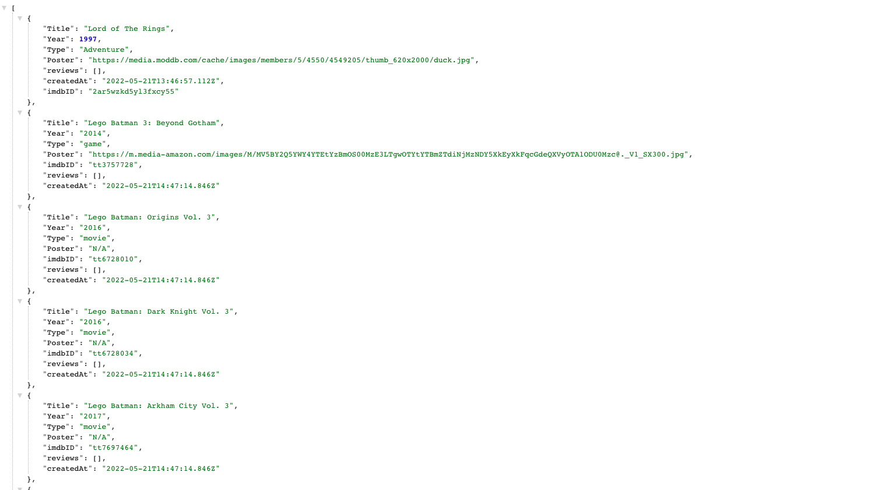
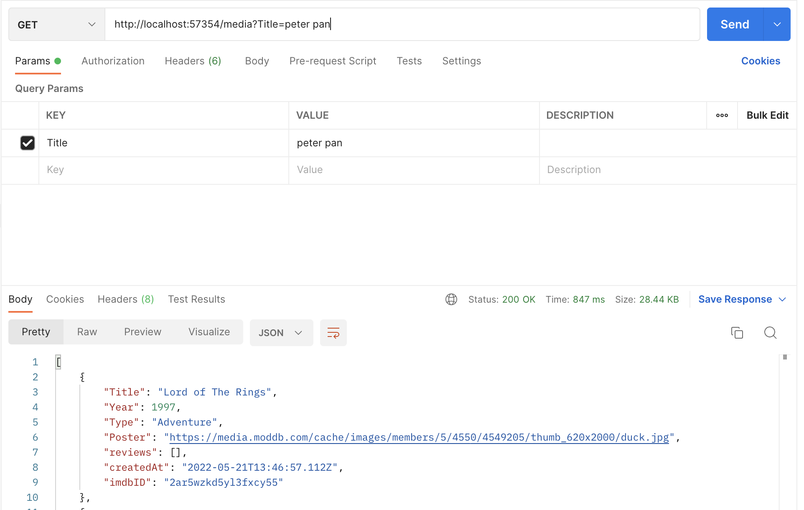
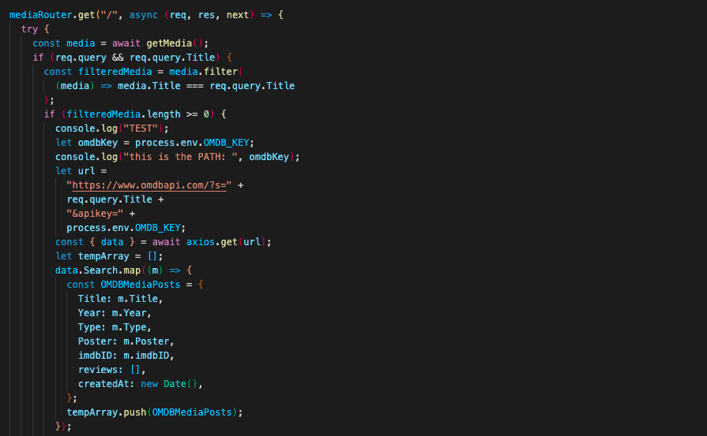

<h1>Backend build in Node / Express</h1>

This was a backend I built containing a list of movies. You can see the backend here on Heroku: https://m5d10-benchmark.herokuapp.com/media .

The backend was built using Node and Express.js. Router wise it includes a GET, POST, GET:byId, PUT and DELETE request. As well as a "review" section that is nested inside the "media" folder. Again see what I mean here: https://m5d10-benchmark.herokuapp.com/media 

One of the main features for this backend is the ability to copy a search query from the OMDBAPI (http://www.omdbapi.com/) into my own local JSON file. 

This means that if I, for instance, make a GET request via Postman on with "http://localhost:57354/media?Title=Sound of Music", it will check if I have the "Sound of Music" titles from the OMDB api on my local JSON file. And if not, it will add them. See screenshots below for explanation.

<h2>Technologies used:</h2>

- Express

- Node

- NPM

- GIT

- Heroku

<h2>Screenshots:</h2>

